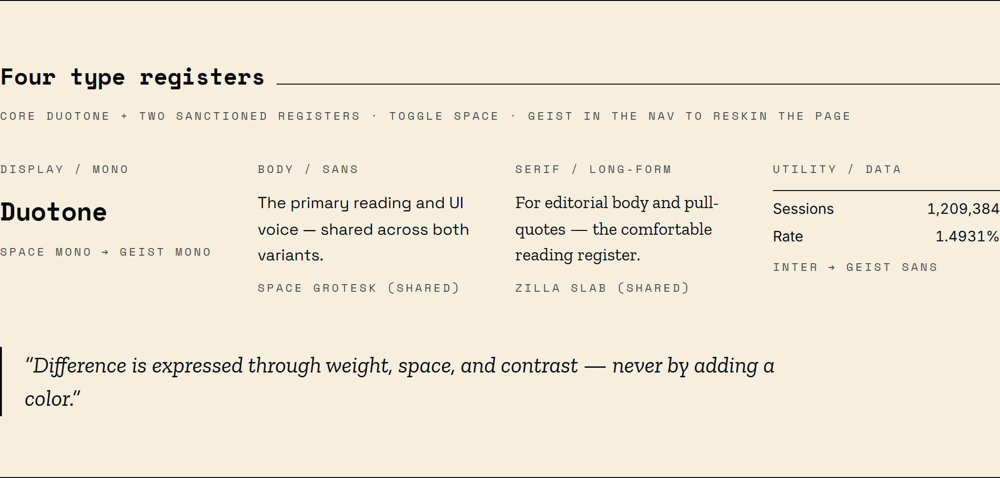
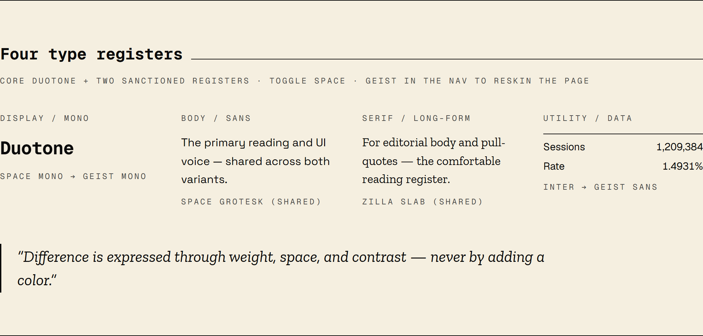

# Lux Design System

[](https://github.com/luxsolari/lux-design-system/releases)
[](LICENSE)

<p align="center">
  <a href="https://luxsolari.github.io/lux-design-system/">
    
  </a>
</p>

<p align="center"><strong><a href="https://luxsolari.github.io/lux-design-system/">View the live demo →</a></strong></p>

A Claude Code plugin that teaches Claude **Duotone Swiss** — Lux Solari's house
design language — so every project you build shares one consistent, opinionated
aesthetic.

## The aesthetic

**Duotone strict, Swiss-minimalist.** Two functional colors — ink (`#0a0a0a`) and
warm cream (`#f5efe0`) — plus a single blood-red accent (`#8b2e2e`). No success
green, no info blue, no second accent. Win/loss, active/inactive, emphasis, and
error are all expressed through **typography weight, spacing, and contrast — never
by adding a color.**

- Visible 1px borders everywhere; **no shadows** (elevation is a background step).
- Generous whitespace; mostly square corners.
- **Space Mono** for headings, data, tags, and nav; **Space Grotesk** for body.
- Uppercase monospace labels with wide letter-spacing.
- Hand-rolled SVG charts — no chart libraries.

## See it

Light and dark are the same two-color system inverted — difference by contrast,
never by a new hue:

| Light | Dark |
|-------|------|
|  |  |

Two font variants share a Space Grotesk body + Zilla Slab serif spine and swap only
the mono signature and the utility voice — **MAIN** (Space Mono + Inter) and
**ALT** (Geist Mono + Geist Sans). The plugin asks which to apply, defaulting to
MAIN:

| MAIN — Space | ALT — Geist |
|--------------|-------------|
|  |  |

The component library, palette, and hand-rolled + Observable Plot charts:


## What it does

Once installed, the `lux-design-system` skill activates automatically whenever
Claude builds or restyles UI — components, pages, forms, dashboards, Tailwind/CSS
themes — and applies these tokens and patterns by default, even if you don't name
the design system. You can also invoke it explicitly ("apply my design system",
"make this duotone swiss").

The skill bundles:

- **`assets/theme.css`** — ready-to-paste Tailwind 4 theme with every token for
  light + dark mode. Drop it into `app/globals.css` (or any global stylesheet).
- **`references/components.md`** — the full component catalogue: buttons, tags,
  status pips, modals, toggles, cards, inputs, and the SVG chart patterns.

## Install

Add the marketplace, then install:

```
/plugin marketplace add luxsolari/lux-solari-plugins
/plugin install lux-design-system
```

## Applying it to a project

1. Copy `assets/theme.css` into your global stylesheet.
2. Add the Space Grotesk + Space Mono Google Fonts link (or `next/font`).
3. Build with the semantic tokens (`bg-background`, `text-foreground`,
   `border-border`, `bg-primary`, …) and the component patterns.

Dark mode is the `.dark` class on `<html>`, toggled via JS and persisted to
`localStorage` under a `theme` key.

## License

MIT © 2026 Lux Solari (Luciano Laje)
