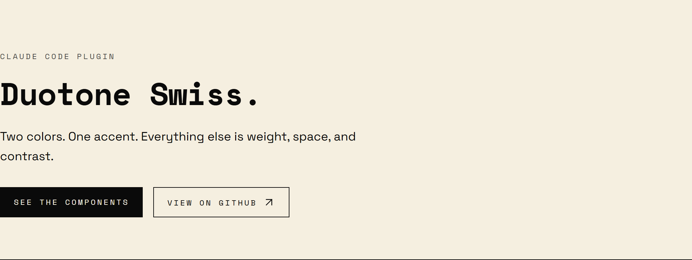
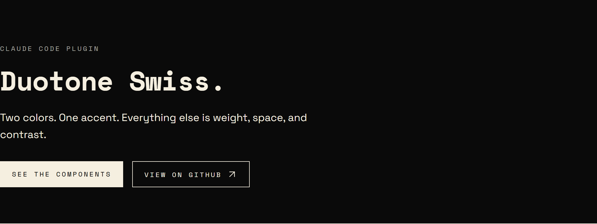
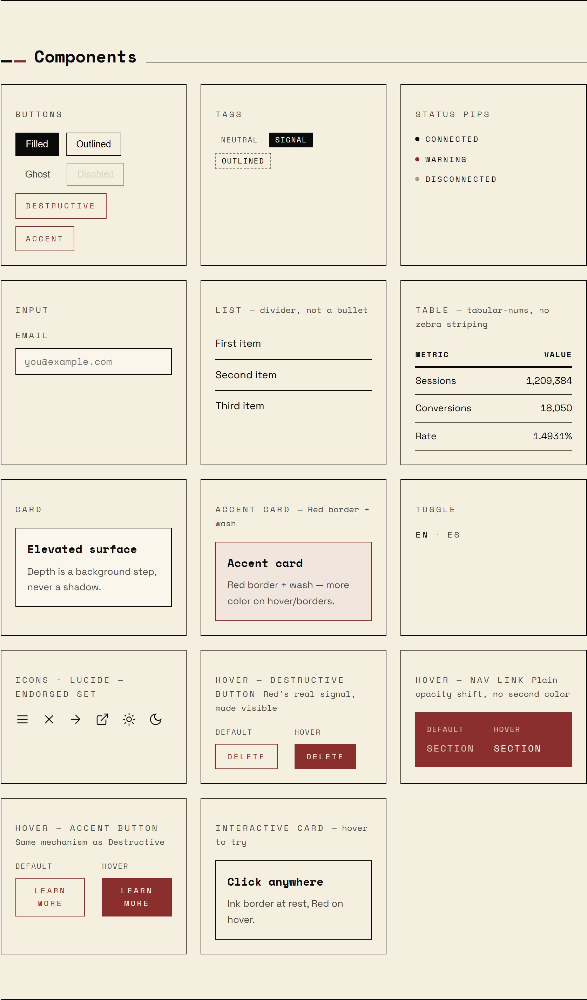
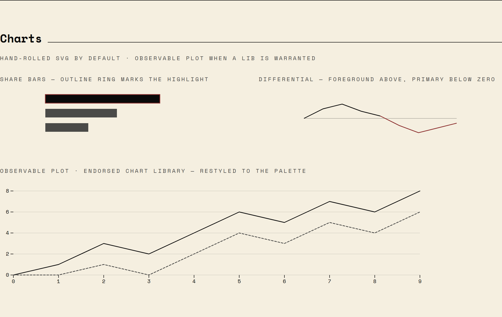

# Lux Swiss

[](https://github.com/luxsolari/lux-swiss/releases)
[](LICENSE)
[](LICENSE-DESIGN)

<p align="center">
  <a href="https://luxsolari.github.io/lux-swiss/">
    
  </a>
</p>

<p align="center"><strong><a href="https://luxsolari.github.io/lux-swiss/">View the live demo →</a></strong></p>

A Claude Code plugin that teaches Claude **Lux Swiss** (formerly Duotone
Swiss) — Lux Solari's house design language — so every project you build
shares one consistent, opinionated aesthetic.

Lux Swiss and its sibling, [Tri-Swiss](https://github.com/luxsolari/tri-swiss),
are the two house-mark design systems that carry Lux Solari's personal
brand identity into every project built with them — related governance,
distinct palettes. See [HOUSE-MARK.md](HOUSE-MARK.md) for how the two
relate.

## The aesthetic

**Duotone strict, Swiss-minimalist.** Two functional colors — ink (`#0a0a0a`) and
warm cream (`#f5efe0`) — plus a single blood-red accent (`#8b2e2e`) that now also
marks a genuine Structural Block (a solid-color sidebar/hero band, capped at ~25%
of viewport, or a bold word inside a heading) and one governed brand-moment
element per page (larger and bolder than any other heading). No success
green, no info blue, no second accent. Win/loss, active/inactive, emphasis, and
error are all expressed through **typography weight, spacing, and contrast — never
by adding a color.**

- Visible 1px borders everywhere; **no shadows** (elevation is a background step).
- Generous whitespace; mostly square corners.
- **Space Mono** for headings, data, tags, and nav; **Space Grotesk** for body.
- Uppercase monospace labels with wide letter-spacing.
- Hand-rolled SVG charts — no chart libraries.

## See it

Light and dark are the same two-color system inverted — difference by contrast,
never by a new hue:

| Light | Dark |
|-------|------|
|  |  |

The component library, palette, and hand-rolled + Observable Plot charts:




## What it does

Once installed, the `lux-swiss` skill activates automatically whenever
Claude builds or restyles UI — components, pages, forms, dashboards, Tailwind/CSS
themes — and applies these tokens and patterns by default, even if you don't name
the design system. You can also invoke it explicitly ("apply my design system",
"make this lux swiss", "make this duotone swiss").

The skill bundles:

- **`assets/theme.css`** — ready-to-paste Tailwind 4 theme with every token for
  light + dark mode. Drop it into `app/globals.css` (or any global stylesheet).
- **`references/components.md`** — the full component catalogue: buttons, tags,
  status pips, modals, toggles, cards, inputs, and the SVG chart patterns.

## Install

Add the marketplace, then install:

```
/plugin marketplace add luxsolari/lux-solari-plugins
/plugin install lux-swiss
```

## Applying it to a project

1. Copy `assets/theme.css` into your global stylesheet.
2. Add the Space Grotesk + Space Mono Google Fonts link (or `next/font`).
3. Build with the semantic tokens (`bg-background`, `text-foreground`,
   `border-border`, `bg-primary`, …) and the component patterns.

Dark mode is the `.dark` class on `<html>`, toggled via JS and persisted to
`localStorage` under a `theme` key.

## License

This repository is dual-licensed:

- **Tooling and scripts** (`scripts/`, CI config, git hooks) — MIT ©
  2026 Lux Solari (Luciano Laje). See [LICENSE](LICENSE).
- **The design system itself** (`skills/lux-swiss/`, `docs/index.html`,
  `docs/assets/`, [HOUSE-MARK.md](HOUSE-MARK.md)) — CC BY-SA 4.0 © 2026
  Lux Solari (Luciano Laje). Free to use and adapt, including
  commercially, provided you credit Lux Solari and license your
  derivative under the same terms. See [LICENSE-DESIGN](LICENSE-DESIGN).
