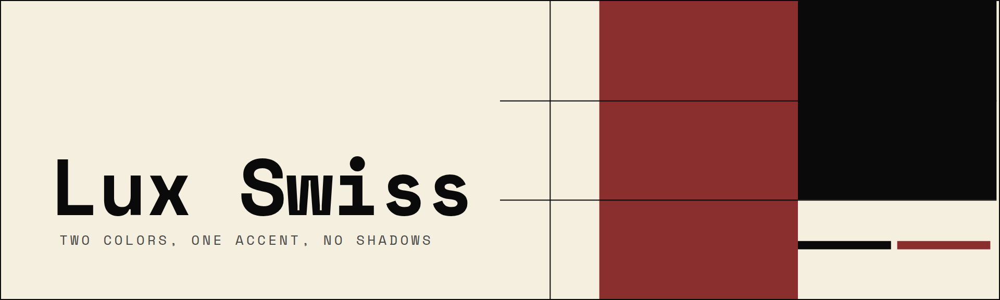
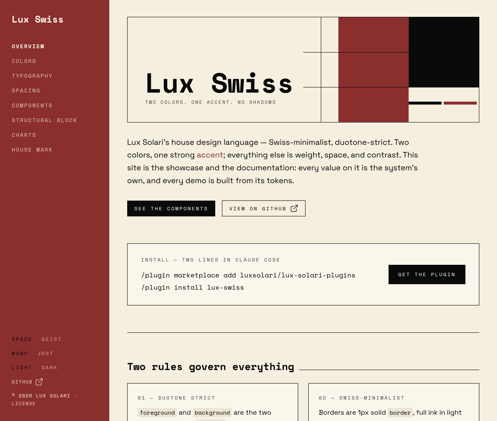
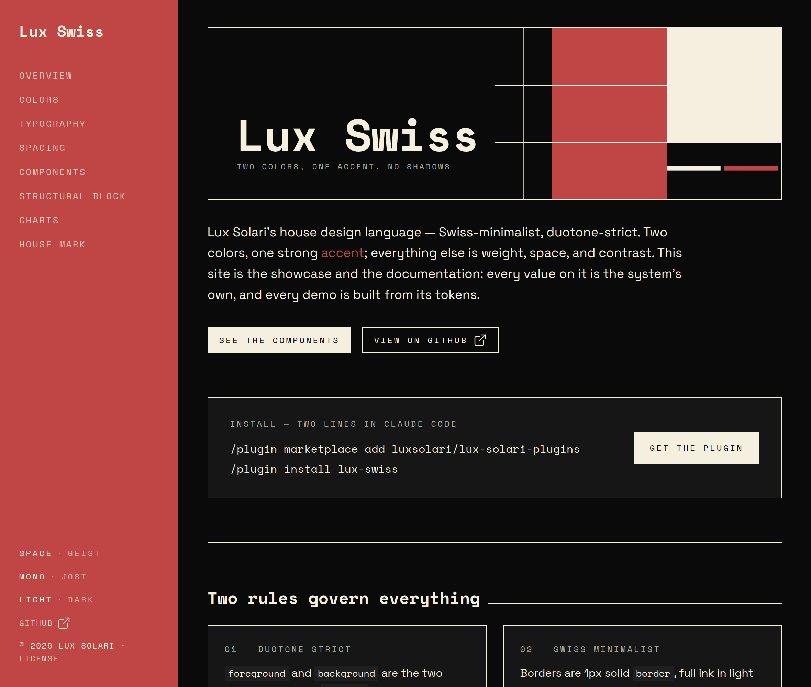
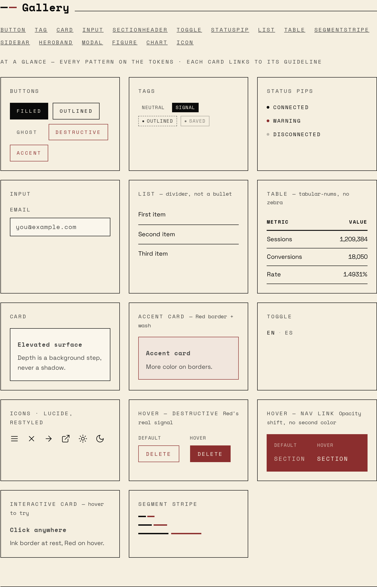
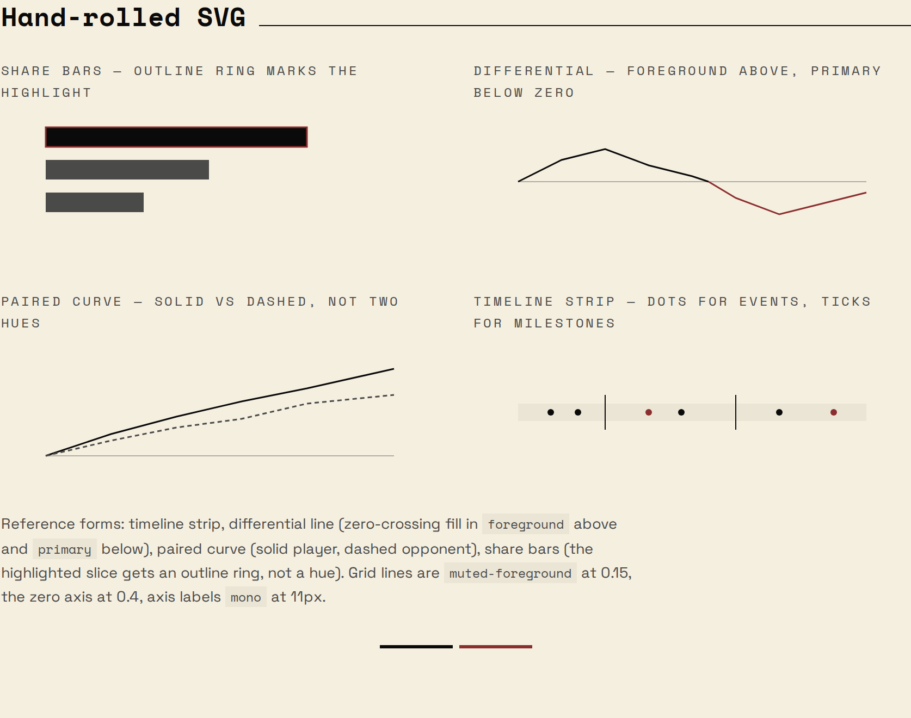

# Lux Swiss

[](https://github.com/luxsolari/lux-swiss/releases)
[](LICENSE)
[](LICENSE-DESIGN)

<p align="center">
  <a href="https://luxsolari.github.io/lux-swiss/">
    <picture>
      <source media="(prefers-color-scheme: dark)" srcset="docs/assets/banner-dark.png" />
      
    </picture>
  </a>
</p>

<p align="center"><strong><a href="https://luxsolari.github.io/lux-swiss/">Showcase and documentation →</a></strong></p>

A Claude Code plugin that teaches Claude **Lux Swiss** (formerly Duotone
Swiss) — Lux Solari's house design language — so every project you build
shares one consistent, opinionated aesthetic.

Lux Swiss and its sibling, [Tri-Swiss](https://github.com/luxsolari/tri-swiss),
are the two house-mark design systems that carry Lux Solari's personal
brand identity into every project built with them — related governance,
distinct palettes. See [HOUSE-MARK.md](HOUSE-MARK.md) for how the two
relate.

## The aesthetic

**Duotone strict, Swiss-minimalist.** Two functional colors — ink (`#0a0a0a`) and
warm cream (`#f5efe0`) — plus a single blood-red accent (`#8b2e2e`) that now also
marks a genuine Structural Block (a solid-color sidebar/hero band, capped at ~25%
of viewport, or a bold word inside a heading), one governed brand-moment
element per page (larger and bolder than any other heading), and hover-state
feedback wherever an accent signals interactivity. The two-color segment
stripe — ink then Blood Red — is reusable at any length as a decorative
divider, not a one-off. A new Accent button and Accent card put more color
on hover/borders, and a new Interactive card carries the same ink-to-Red
hover transition onto a clickable card. Lists, tables, and images are now
documented patterns too — list/table borders and markers stay
ink/muted-foreground only, and images default to a grayscale/duotone
filter with full color as a scoped exception for photography that is
itself the content. No success green, no info blue, no second accent.
Win/loss, active/inactive, emphasis, and error are all expressed through
**typography weight, spacing, and contrast — never by adding a color.**

- Visible 1px borders everywhere; **no shadows** (elevation is a background step).
- Generous whitespace; mostly square corners.
- **Space Mono** for headings, data, tags, and nav; **Space Grotesk** for
  body — or the **Geist** flavor (Geist Mono + Geist Sans), toggled with
  a single `.geist` class; Zilla Slab (serif, long-form) is shared by both.
- An optional **Jost** heading accent — every heading (`h1`–`h6`), the
  hero title/wordmark, and long-form editorial chapter dividers switch
  to Jost when toggled, independently of the flavor, with a `.jost`
  class; labels, nav, tags, and data stay on the mono flavor.
- Uppercase monospace labels with wide letter-spacing.
- Hand-rolled SVG charts — no chart libraries.

## See it

[luxsolari.github.io/lux-swiss](https://luxsolari.github.io/lux-swiss/) is both
the showcase and the documentation. Its sidebar is the system's own Structural
Block, and every demo on it is plain HTML on the tokens:

| Page | What it documents |
|------|-------------------|
| [Overview](https://luxsolari.github.io/lux-swiss/) | The banner, the two governing rules, how to use the system, the do-not list |
| [Colors](https://luxsolari.github.io/lux-swiss/colors.html) | Thirteen semantic tokens in both themes, Blood Red's four jobs, measured contrast |
| [Typography](https://luxsolari.github.io/lux-swiss/typography.html) | Three roles, the Space/Geist flavors, the weight axis, the heading scale, labels, Jost |
| [Spacing](https://luxsolari.github.io/lux-swiss/spacing.html) | Spacing steps, the one radius, fixed sizes, opacity states |
| [Components](https://luxsolari.github.io/lux-swiss/components.html) | Sixteen patterns with live demos and guidelines |
| [Structural Block](https://luxsolari.github.io/lux-swiss/structural-block.html) | Sidebar, hero band, bold word, the segment stripe, the brand moment, hover hierarchy |
| [Charts](https://luxsolari.github.io/lux-swiss/charts.html) | Hand-rolled SVG and the restyled Observable Plot |
| [House Mark](https://luxsolari.github.io/lux-swiss/house-mark.html) | How Lux Swiss and Tri-Swiss relate |

The site is static HTML under `docs/`, served by GitHub Pages: `docs/assets/site.css`
holds the tokens and every pattern, `docs/assets/site.js` the theme, flavor and Jost
toggles. The banner above is `docs/banner.html`, rendered by
`scripts/capture/banner.sh`.

Light and dark are the same two-color system inverted — difference by contrast,
never by a new hue:

| Light | Dark |
|-------|------|
|  |  |

The component library, palette, and hand-rolled + Observable Plot charts:




## What it does

Once installed, the `lux-swiss` skill activates automatically whenever
Claude builds or restyles UI — components, pages, forms, dashboards, Tailwind/CSS
themes — and applies these tokens and patterns by default, even if you don't name
the design system. You can also invoke it explicitly ("apply my design system",
"make this lux swiss", "make this duotone swiss").

The skill bundles:

- **`assets/theme.css`** — ready-to-paste Tailwind 4 theme with every token for
  light + dark mode. Drop it into `app/globals.css` (or any global stylesheet).
- **`references/components.md`** — the full component catalogue: buttons, tags,
  status pips, modals, toggles, cards, inputs, and the SVG chart patterns.

## Install

Add the marketplace, then install:

```
/plugin marketplace add luxsolari/lux-solari-plugins
/plugin install lux-swiss
```

## Applying it to a project

1. Copy `assets/theme.css` into your global stylesheet.
2. Pick a font flavor — **Space** (default: Space Grotesk + Space Mono) or
   **Geist** (Geist Sans + Geist Mono, via the `.geist` class on `<html>`)
   — and add that flavor's Google Fonts link (or `next/font`); both share
   Zilla Slab as the serif register.
3. Build with the semantic tokens (`bg-background`, `text-foreground`,
   `border-border`, `bg-primary`, …) and the component patterns.

Dark mode is the `.dark` class on `<html>`, toggled via JS and persisted to
`localStorage` under a `theme` key.

## License

This repository is dual-licensed:

- **The design system itself** (`skills/lux-swiss/`, `docs/index.html`,
  `docs/assets/`, [HOUSE-MARK.md](HOUSE-MARK.md)) — CC BY-SA 4.0 © 2026
  Lux Solari (Luciano Laje). Free to use and adapt, including
  commercially, provided you credit Lux Solari and license your
  derivative under the same terms. See [LICENSE-DESIGN](LICENSE-DESIGN).
- **Everything else** (build/tooling scripts, CI config, git hooks, and
  project documentation such as this README) — MIT/X11 © 2026 Lux
  Solari (Luciano Laje). See [LICENSE](LICENSE).
